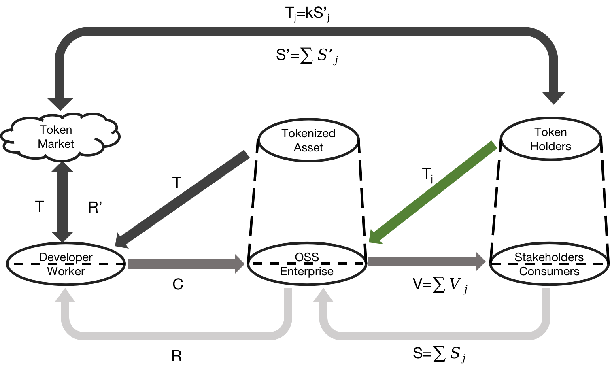

# TokenizedCollaboration

开源协作（例如开源软件）以个人的劳动贡献用于公共的利益，贡献者主要依靠着利他的精神参与，形成非盈利性的社区。但是，对于复杂和长期需要维护的项目非常不利，一方面需要的投入非常大，另一方面当前社区的可持续性不强。特别是在开源软件发展这么久之后，越来越多的企业依靠开源软件获利但却没有相对应的回馈到社区，让社区的贡献者感受到背叛，从而积极性越来越低。

随着web3的发展，我们看到了很多新的模式和应用，特别是在金融和治理方面。而根据相关研究，经济和治理正是阻碍开源协作发展的主要问题，因此我们就基于web3对开源协作进行代币化，并在细节上分析相关的挑战，并设计各种机制用于解决这些问题。

## 当前工作

我们提出了一套专为开源协作设计的框架及详细机制。该框架由一个经济模型和一个治理模型组成。框架设计如图1所示。

图1: 框架设计

###  💰经济模型

我们提出的经济模型的核心在于对开源产品市场价值的代币化，包括代币铸造、定价机制等。

首先，我们深入调研了开源项目在发展上的痛点，特别是fundraising 的问题；然后，针对fundraising的核心问题，构建开源软件的经济模型运行原理，然后对传统经济、当前开源经济以及基于web3的开源经济三种模式在模型运行上的区别，从原理上说明了web3经济模型用于开源激励的好处；最后，我们构建了一个基于web3的开源经济模型，并结合开源软件的开发流程。

最终，本经济模型实现了一个以价值回报为基础的开源的资金募资流程，解决了搭便车的问题，同时实现了开源贡献者之间的公平分配。

### 🗳️治理模型

我们提出的治理模型以透明性、基于贡献的激励和民主参与为特征，包括提案、投票、计票和执行等流程。

我们以开源协作的Web3经济模型为基础，为Web3的代币同时赋予项目治理的权限。对于开源软件项目的治理，我们结合软件工程生命周期和软件需求工程，将治理权限用于软件开发任务的优先级排序。排序后的任务优先级将直接影响贡献者可以从对应的开发任务中获取的新的代币激励的数量。

最终，我们实现了一个贡献越多，治理权限越大，同时治理过程和结果透明、民主，真正体现了开源软件的价值观

### 🏆 产出

- 开源协作相关的调研和问题问卷调查
- 相关工作已经整理成论文
- 项目核心代码正在开发

## 未来展望

未来工作主要在项目实现、社区合和项目合作两方面。

首先，形成一个整体框架的PoC，用于初步的产品功能和设计的展示，并且支持实际的实用、反馈，持续根据反馈意见更新。并且相关代码将逐步开源

其次，对于经济和治理模型设计与项目产业界的实际需求之间的差距，需要与更多的社区和项目方合作，因此欢迎刚兴趣的项目方和社区一起深入参与整体框架的试用、优化或者建议。相关建议欢迎在讨论区留言。

点击链接讨论留言[🔗](https://github.com/CryptoFly633/TokenizedCollaboration/issues/1)
